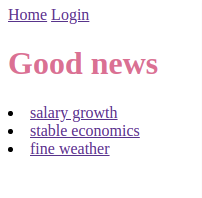

# Good news :sunglasses:

## Vision 

The application created for learning purposes only \
Main focus on structure created with the help of Python Back End thechnologies \
Web design and Front End thecnologies are not in scope of this project

Good news Web application should provide:

1. Display list of news
2. Show news text 
3. Store news, journalist data in database
4. Register new journalist
5. Authenticate a journalist and provide abaility to add news

## 1 News
### 1.1 Display list of News
As a user I want to see the list of **10 latest** good news titles, to choose  good news to read. 

### 1.2 Show news text 
As a user I want to select good news from the list, by clicking on news title so that I can read news text, see the author of parcicular news. 

### 1.3 Show other news for the chosen news author
As a user I want to see what other news created the author of chosen news.

## 2 Journalist

### 2.1 Registration
As a new journalist I want to register on site by filling in registration form
 

### 2.2 Login
As a registered journalist I want to login by entering my email and password

### 2.3 Login incorrect data
As a registered journalist I want to see the message "Please logged in to view this page" 
when I try wrong email or password to login 

### 2.4 Add news
As a logged in journalist I want to add news so that my news is shown on home page

 

